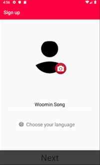
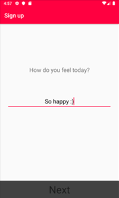
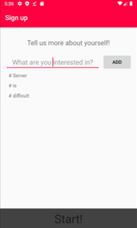
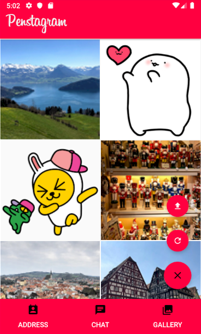

# Penstagram
Penstagram(PENpal + inSTAGRAM) is a penpal app, where you can find new friends who are interested in them.

펜스타그램은 사진을 업로드하고, 업로드한 사진을 통해 새로운 외국인 친구들을 만들 수 있는 펜팔 앱입니다.

## What is it?
2019년 겨울 몰입캠프 2주차 과제로 제작한 안드로이드 어플리케이션입니다.

## Used
Language: Kotlin

Android Studio

Nodejs server with MongoDB and Socket.io

## Features
### 1. Register and log in with Facebook

Facebook SDK를 활용해, facebook id를 이용해 로그인할 수 있습니다.

### 2. Upload your photos

갤러리 탭에서는 RecyclerView로 펜스타그램을 이용하는 다른 사용자들이 올린 사진들을 볼 수 있습니다. (현재 테스트 버전에서는 사용자와 사진 수가 적어 각 사용자가 첫 번째로 올린 사진들을 모두 보여주고 있으나, 랜덤하게 일정 개수만 보여주는 방법으로 수정될 예정입니다.)  
우측 하단에 위치한 floating action button을 누르면 upload 버튼과 refresh 버튼을 열고 닫을 수 있습니다. 
* upload 버튼을 누르면 사용자 디바이스의 사진첩으로 이동하여 사용자가 올리고 싶은 사진을 선택할 수 있습니다. 선택된 사진은 서버를 통해 데이터베이스에 저장됩니다. (본인이 올린 사진들을 확인할 수 있는 기능은 구현 예정입니다.)  
* refresh 버튼을 누르면 서버를 통해 데이트베이스에 새로 추가된 사진이 있는지 확인한 후, 있다면 그 사진들 다운로드하여 사진들의 순서를 뒤섞어 갤러리를 재구성합니다.  

### 3. Check other users' photos and add them as friends

갤러리 탭의 RecyclerView는 사진들의 썸네일만을 보여줍니다. 각 썸네일을 클릭하면 해당 사진에 대한 activity로 이동하여 사진을 올린 사용자에 대한 정보 (이름, 프로필사진, 상태메시지, 국가, 해시태그)와 그 사진 전체의 ImageView를 보여줍니다.  
하단의 친구추가 버튼을 누르면 사진을 올린 사용자와 친구를 맺을 수 있고, 자신의 친구목록은 연락처 탭에서 확인할 수 있습니다. 

연락처 탭에는 친구의 이름, 프로필 사진, 그리고 국적이 표시됩니다. 목록의 아이템을 클릭하면 해당 친구와의 채팅방에 입장하게 됩니다.

### 4. Chat with your friends

채팅방에서는 친구와 실시간으로 채팅할 수 있습니다. 실시간 채팅 기능은 Socket.io를 이용해 구현되었습니다.

### 5. Enhance your languae skills

펜팔 앱인만큼, 새로운 언어로 채팅하는 것을 돕기 위한 기능이 구현되어 있습니다. 언어 관련 기능은 구글 번역 API를 사용해 구현했습니다.
* 상대방의 메시지를 길게 누르면 사용자의 언어로 메시지를 번역해줍니다.
* 자신의 메시지를 길게 누르면 맞춤법 검사를 해 틀린 부분을 알려줍니다.
